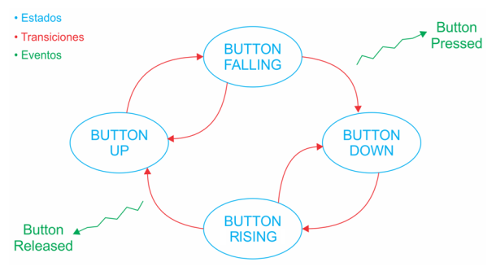

# Programación de Microcontroladores - Práctica 4

## Descripción
Implementar una máquina de estados finitos para trabajar con anti-rebotes por software, siguiento la representación de la figura:

La MEF permite leer el estado del pulsador USER_BUTTON y generar acciones o eventos ante un flanco descendente o ascendente, de acuerdo al siguiente diagrama:

El programa realiza las siguientes acciones:
- Tooglea el LED1 ante un evento de pressed del pulsador.
- Tooglea el LED3 ante un evento de release del pulsador.
- Blink del LED2 con un per'iodo que se varía entre 100ms y 500ms en pasos de 100ms cada vez que se presiona el pulsador.

## Conexión
LEDs y USER_BUTTON conectados en:
- LED1 -> B12
- LED2 -> B13
- LED3 -> B14
- USER_BUTTON -> A9

## Compilación
El proyecto se compila mediante el comando `make` dentro de la carpeta de la práctica. Luego encontrará dentro de la carpeta build el binario a descargar en la placa.
